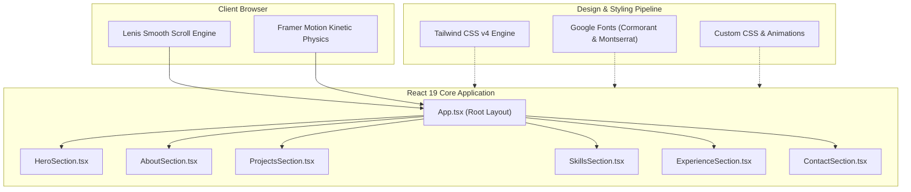

<div align="center">

  

  <p align="center">
    <b>A premier showcase merging haute couture editorial typography, inertial physics, and dark luxury minimalism.</b>
  </p>

  <p align="center">
    <a href="https://react.dev/"></a>
    <a href="https://www.typescriptlang.org/"></a>
    <a href="https://vite.dev/"></a>
    <a href="https://tailwindcss.com/"></a>
    <a href="https://motion.dev/"></a>
    <a href="https://lenis.darkroom.engineering/"></a>
  </p>

  <p align="center">
    <a href="#-visual-identity--design-tokens"><b>Palette & Design</b></a> •
    <a href="#-experience-suite--features"><b>Features</b></a> •
    <a href="#-architectural-blueprint"><b>Architecture</b></a> •
    <a href="#-quickstart--execution"><b>Quickstart</b></a> •
    <a href="#-repository-anatomy"><b>Anatomy</b></a> •
    <a href="#-deployment-matrix"><b>Deploy</b></a>
  </p>

</div>

<br />

---

## 🎨 Visual Identity & Design Tokens

> *"Perfection is achieved, not when there is nothing more to add, but when there is nothing left to take away."*

<div align="center">

| Token | Preview | Hex | Semantic Role |
| :--- | :---: | :---: | :--- |
| **Obsidian Canvas** |  | `#000000` | Primary backdrop & negative space foundation |
| **Warm Ivory** |  | `#E8DFD8` | Primary display & high-contrast editorial typography |
| **Champagne Accent** |  | `#cbb59d` | Secondary highlights, text selections & badges |
| **Liquid Gold** |  | `#D4AF37` | Dynamic cursor borders & spotlight illuminations |

</div>

<br />

### 🖋️ Typography Pairing
* **Display Serif**: [`Cormorant Garamond`](https://fonts.google.com/specimen/Cormorant+Garamond) *(Editorial weight, refined ligatures, dramatic headings)*
* **Body Sans**: [`Montserrat`](https://fonts.google.com/specimen/Montserrat) *(Clean geometric clarity, high legibility at micro scales)*

---

## ✨ Experience Suite & Features

```
  ┌─────────────────┐       ┌─────────────────┐       ┌─────────────────┐
  │  01. HERO GATE  │ ───>  │  02. 3D ABOUT   │ ───>  │ 03. SCROLLSTACK │
  │  Custom Cursor  │       │ Dynamic Spring  │       │ Sticky Layering │
  │ Kinetic Reveals │       │  Spotlight Mesh │       │  Curated Works  │
  └─────────────────┘       └─────────────────┘       └─────────────────┘
                                                               │
  ┌─────────────────┐       ┌─────────────────┐                │
  │  06. MINIMALIST │ <───  │ 05. JOURNEY MAP │ <──────────────┘
  │   DIRECT DIAL   │       │ Career Timeline │
  │ Social Terminal │       │ Impact Metrics  │
  └─────────────────┘       └─────────────────┘
```

<br />

| Module | Feature Highlight | Technical Underpinning |
| :--- | :--- | :--- |
| **🎬 Cinematic Hero** | Interactive magnetic cursor tracking, watermark texture blend, and staggered title choreography | `framer-motion` variants + `useMotionValue` |
| **🪐 3D Spotlight About** | Mouse-following radial light beam with responsive 3D card tilt physics | Dual spring dampers (`stiffness: 220, damping: 18`) |
| **🗂️ Sticky ScrollStack** | Vertical card accumulation effect creating an editorial multi-project deck | CSS sticky positioning + Framer scroll progress |
| **⚡ Domain Matrix** | Micro-animated skill categorizations with custom tag hierarchy | Tailwind grid + glassmorphism filters |
| **⏳ Chrono Timeline** | Minimalist career path charting professional growth and technical milestones | Vertical SVG trace line + scroll-triggered opacity |
| **📬 Contact Terminal** | Refined direct reach-out portal with interactive social links | Focus-visible rings + styled selection tokens |

---

## 🏛️ Architectural Blueprint



---

## 🚀 Quickstart & Execution

### Prerequisites
* **Node.js** `>= 18.0.0` (LTS recommended)
* **npm** `>= 9.0.0` (or `pnpm` / `yarn` / `bun`)

### 1. Clone & Enter
```bash
git clone https://github.com/zaheer1247/cinematic-portfolio.git
cd cinematic-portfolio
```

### 2. Install Dependencies
```bash
npm install
```

### 3. Launch Development Server
```bash
npm run dev
```
> ⚡ Local preview ready instantly at **`http://localhost:5173`**

---

## 💻 Developer Command Matrix

| Task | Command | Description |
| :--- | :--- | :--- |
| **Development** | `npm run dev` | Spins up Vite dev server with instant Hot Module Replacement (HMR) |
| **Type Check & Build** | `npm run build` | Validates TypeScript schemas and generates optimized distribution bundle in `dist/` |
| **Production Preview** | `npm run preview` | Spins up a local web server to inspect and benchmark the compiled `dist/` build |
| **High-Speed Lint** | `npm run lint` | Runs [Oxlint](https://oxc.rs/) for sub-second static analysis and syntax validation |

---

## 📂 Repository Anatomy

```text
cinematic-portfolio/
 ├── 🌐 public/                     # Static public assets & favicon
 ├── 🎨 src/
 │    ├── 🖼️ assets/                # High-res photography, watermarks, & icons
 │    ├── 🧩 components/            # UI components & architectural sections
 │    │    ├── ⚡ HeroSection.tsx       # Landing viewport & custom cursor
 │    │    ├── 🪐 AboutSection.tsx      # 3D interactive physics card & spotlight
 │    │    ├── 🎨 ProjectsSection.tsx   # Project showcase & case studies
 │    │    ├── 🗂️ ScrollStack.tsx       # Sticky card stacking motion engine
 │    │    ├── 🛠️ SkillsSection.tsx     # Technical competency matrix
 │    │    ├── ⏳ ExperienceSection.tsx # Chronological career milestones
 │    │    └── 📬 ContactSection.tsx    # Communication grid & social links
 │    ├── 📄 App.tsx                 # Root layout & section orchestration
 │    ├── 🎨 index.css               # Font declarations & Tailwind v4 directive
 │    ├── 🎭 App.css                 # Custom keyframe animations & scroll rules
 │    └── 🚀 main.tsx                # React DOM tree bootstrap
 ├── ⚙️ index.html                  # HTML entry point with SEO metadata
 ├── ⚙️ vite.config.ts              # Vite plugins (React + Tailwind CSS)
 ├── ⚙️ tsconfig.json               # TypeScript compiler options
 └── 📦 package.json                # Project manifest, scripts & dependencies
```

---

## 🚢 Deployment Matrix

Easily host with zero-configuration platforms:

<details>
<summary><b>Deploying to Vercel</b></summary>

```bash
npm install -g vercel
vercel
```
</details>

<details>
<summary><b>Deploying to Netlify</b></summary>

```bash
npm install -g netlify-cli
npm run build
netlify deploy --prod --dir=dist
```
</details>

<details>
<summary><b>Deploying to GitHub Pages</b></summary>
Set your build output folder to <code>dist</code> in your GitHub Pages repository settings.
</details>

---

<div align="center">

  

  <sub>Crafted with obsessive attention to design aesthetics & frontend performance.</sub>
  <br />
  <sub>Released under the <b>MIT License</b>.</sub>

</div>
